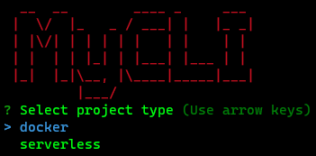
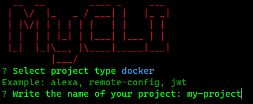
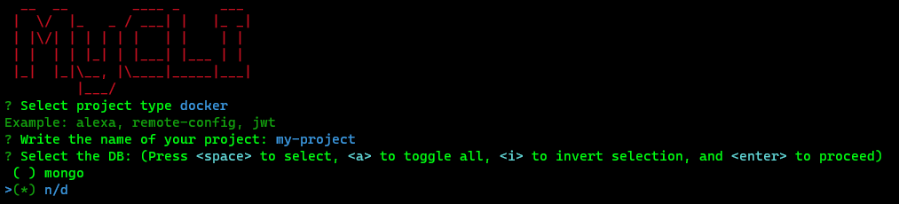
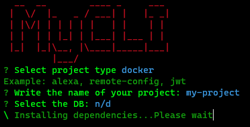

# My Cli

Node Application generator.

### Usage

## If you already have the old my-cli in your machine, run:
```shell
$ npm uninstall mycli -g
```
## You will need the node version in 14.X.X (to check your node version, run:)
```shell
$ node -v
```

#### Install the command line:
```shell
$ git clone https://github.com/SouzRod/my-cli.git
$ cd my-cli
$ npm install -g
```

#### Run the project with:

```shell
$ mycli
```

#### How the project works

##### Choose the type of project


##### Now, write the name of the project


##### Select the database


##### If everything went right, the CLI will start install dependencies
